<div align="center">

# 🚗 Vehicle Detection and Classification System

### Leveraging Deep Learning & Big Data Analytics for Intelligent Traffic Monitoring

<br/>

[](https://www.python.org/)
[](https://www.tensorflow.org/)
[](https://keras.io/)
[](https://docs.ultralytics.com/)
[](https://streamlit.io/)
[](https://spark.apache.org/)
[](https://colab.research.google.com/)
[](https://opencv.org/)
[](https://numpy.org/)
[](https://matplotlib.org/)
[](https://scikit-learn.org/)
[](https://github.com/DMInaam/Vehicle-Detection-and-Classification)
[](#-license)

<br/>

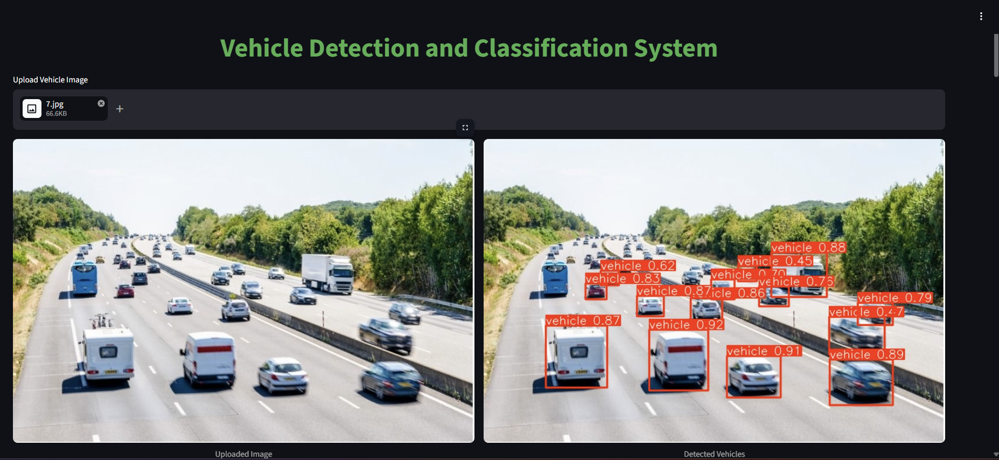

<br/>

*An end-to-end pipeline that detects vehicles using **YOLOv8**, classifies them with **EfficientNetB0**, processes data at scale with **Apache Spark**, and serves real-time predictions through a **Streamlit** web application.*

---

[Overview](#-overview) · [Models & Results](#-models--performance) · [Quick Start](#-quick-start) · [Architecture](#-workflow-pipeline) · [Technologies](#-technologies-used) · [Future Work](#-future-work)

</div>

---

## 📑 Table of Contents

- [📌 Overview](#-overview)
- [🎯 Objectives](#-objectives)
- [🧠 Models & Performance](#-models--performance)
  - [YOLOv8 — Vehicle Detection](#-vehicle-detection--yolov8)
  - [EfficientNetB0 — Vehicle Classification](#-vehicle-classification--efficientnetb0)
- [🖼️ Sample Results](#️-sample-results)
- [📂 Project Structure](#-project-structure)
- [🔄 Workflow Pipeline](#-workflow-pipeline)
- [📊 Dataset Information](#-dataset-information)
- [⚡ Apache Spark Usage](#-apache-spark-usage)
- [🚀 Quick Start](#-quick-start)
- [🖥️ Technologies Used](#️-technologies-used)
- [🎯 Key Features](#-key-features)
- [📊 Final Performance Summary](#-final-performance-summary)
- [🔮 Future Work](#-future-work)
- [📌 Applications](#-applications)
- [🏁 Conclusion](#-conclusion)
- [👨‍💻 Author](#-author)
- [📜 License](#-license)

---

## 📌 Overview

This project implements an intelligent **Vehicle Detection and Classification System** that combines state-of-the-art deep learning with big data technologies to create a robust, production-ready pipeline.

<table>
<tr>
<td width="50%">

### 🔍 What It Does

- **Detects** vehicles in images using YOLOv8 with bounding box localization
- **Classifies** detected vehicles into **5 categories** (Bus, Car, Motorcycle, Truck, Van)
- **Processes** large-scale datasets using Apache Spark for distributed computing
- **Serves** real-time predictions through an interactive Streamlit web application

</td>
<td width="50%">

### 💡 Why It Matters

Modern traffic monitoring systems demand **accuracy**, **speed**, and **scalability**. This project demonstrates how cutting-edge computer vision techniques can be applied to real-world surveillance and traffic analysis — from smart city infrastructure to automated parking systems.

</td>
</tr>
</table>

---

## 🎯 Objectives

| # | Objective | Technology |
|:-:|-----------|:----------:|
| 1 | Detect vehicles in images with high precision | YOLOv8 |
| 2 | Classify detected vehicles into 5 categories | EfficientNetB0 |
| 3 | Process large-scale datasets efficiently | Apache Spark |
| 4 | Improve classification accuracy through fine-tuning | Transfer Learning |
| 5 | Deploy an interactive web application | Streamlit |
| 6 | Enable real-time public access | Ngrok |

---

## 🧠 Models & Performance

### 🚘 Vehicle Detection — YOLOv8

<table>
<tr>
<td width="40%">

#### Model Configuration

| Parameter | Value |
|:----------|------:|
| Architecture | **YOLOv8s** |
| Task | Object Detection |
| Input Size | 640 × 640 |
| Batch Size | 16 |
| Format | PyTorch (`.pt`) |

</td>
<td width="60%">

#### Detection Metrics

| Metric | Score | |
|:-------|------:|:-|
| **Precision** | **0.9585** | 🟢 |
| **Recall** | **0.9563** | 🟢 |
| **mAP@0.5** | **0.9894** | 🟢 |
| **mAP@0.5–0.95** | **0.8140** | 🟢 |

> 💡 The detection model achieves near-perfect mAP@0.5, demonstrating excellent localization across all vehicle types.

</td>
</tr>
</table>

<details>
<summary>📊 <b>View Detection Results</b></summary>
<br/>

<div align="center">

**Training Metrics Overview**

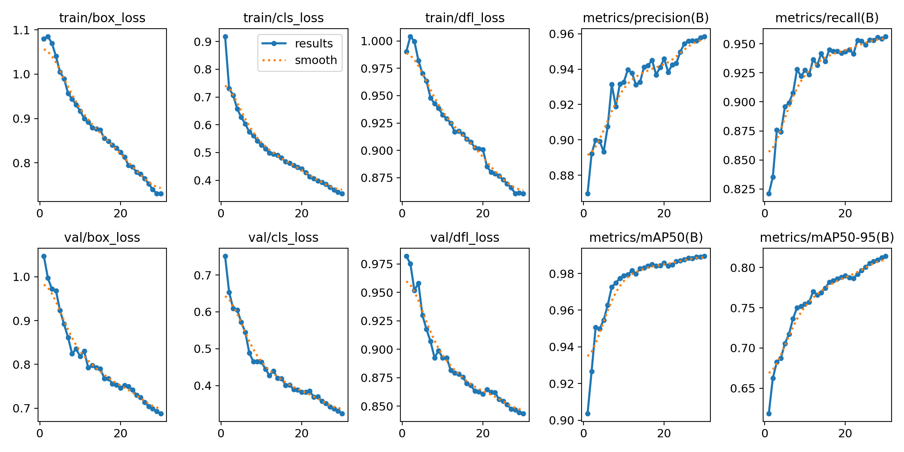

<br/><br/>

**Precision-Recall Curve**

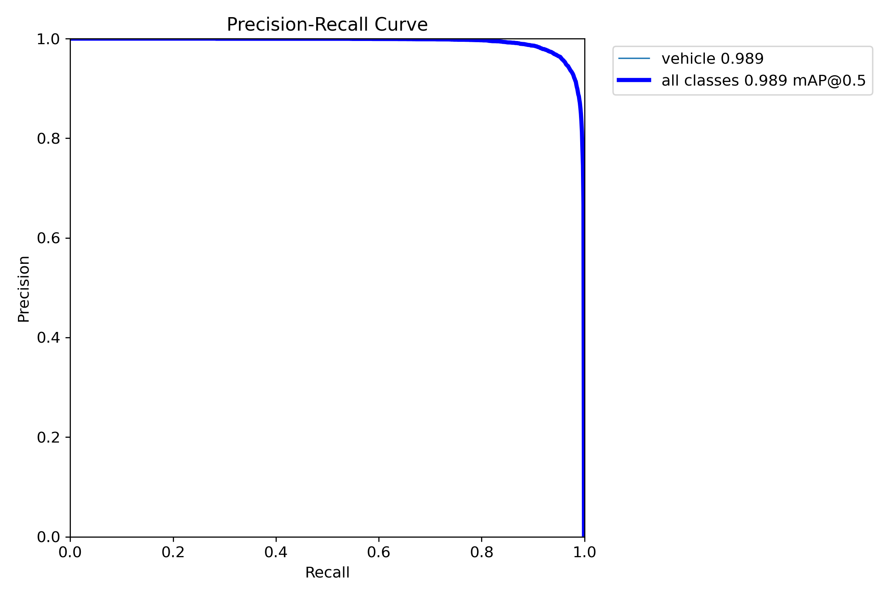

<br/><br/>

**Normalized Confusion Matrix**

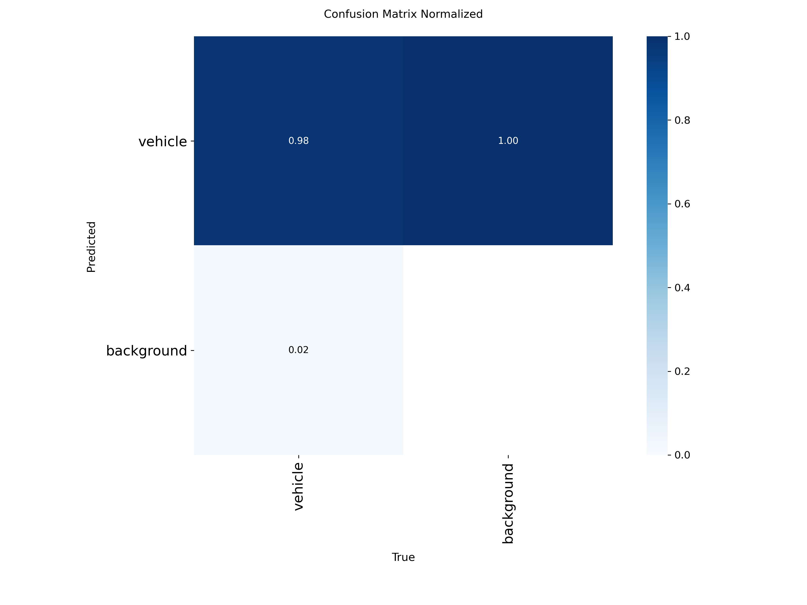

<br/><br/>

**Training Batch Sample**

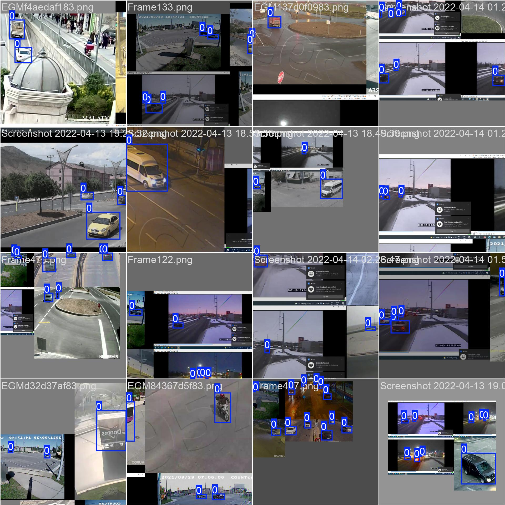

<br/><br/>

**Validation — Ground Truth vs. Predictions**

| Ground Truth | Predictions |
|:------------:|:-----------:|
| 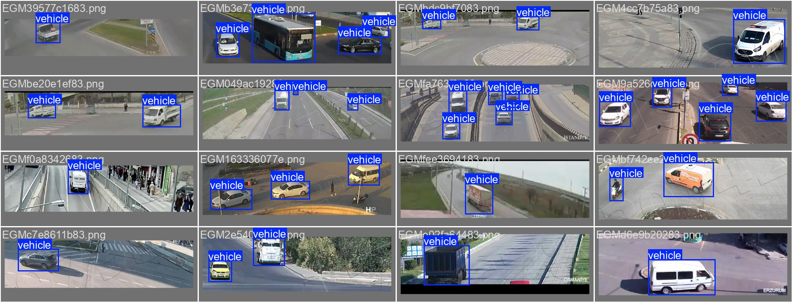 | 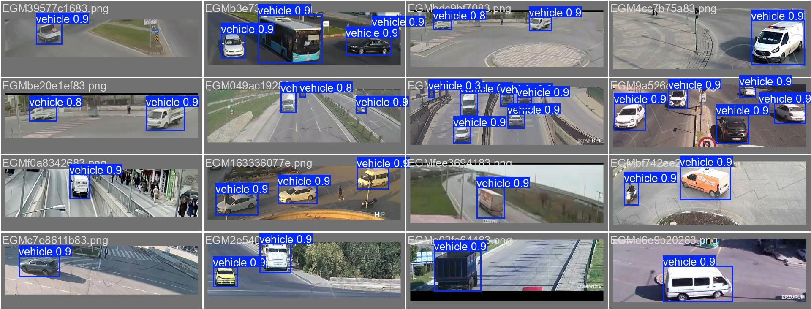 |

</div>
</details>

---

### 🚗 Vehicle Classification — EfficientNetB0

<table>
<tr>
<td width="40%">

#### Model Configuration

| Parameter | Value |
|:----------|------:|
| Architecture | **EfficientNetB0** |
| Classes | 5 |
| Strategy | Transfer Learning |
| Fine-Tuning | ✅ Yes |
| Format | Keras (`.keras`) |

</td>
<td width="60%">

#### Classification Metrics

| Metric | Score | |
|:-------|------:|:-|
| **Best Val. Accuracy** | **94.25%** | 🟢 |
| **Final Accuracy** | **92.00%** | 🟢 |
| **Macro F1-Score** | **0.92** | 🟢 |
| **Weighted F1-Score** | **0.92** | 🟢 |

> 💡 Fine-tuning significantly boosted classification accuracy, improving generalization across all vehicle categories.

</td>
</tr>
</table>

#### Supported Vehicle Classes

<div align="center">

| 🚌 Bus | 🚗 Car | 🏍️ Motorcycle | 🚛 Truck | 🚐 Van |
|:------:|:-----:|:------------:|:-------:|:-----:|

</div>

<details>
<summary>📊 <b>View Classification Results</b></summary>
<br/>

<div align="center">

**Training & Validation Accuracy**

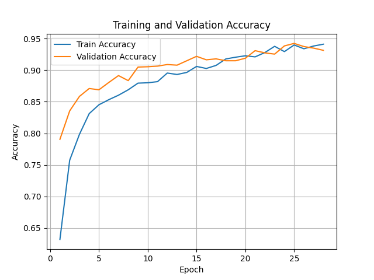

<br/><br/>

**Training & Validation Loss**

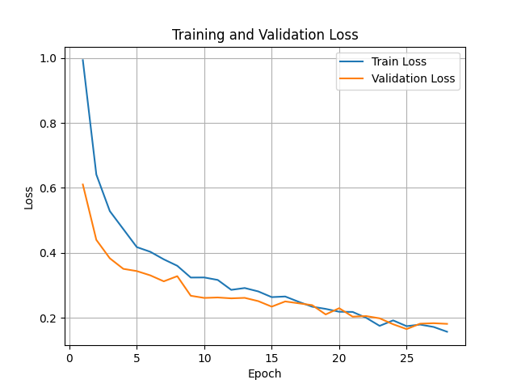

<br/><br/>

**Confusion Matrix**

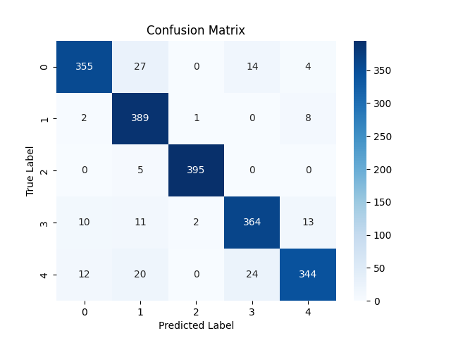

</div>
</details>

---

## 🖼️ Sample Results

<div align="center">

### Streamlit Application Interface


<br/><br/>

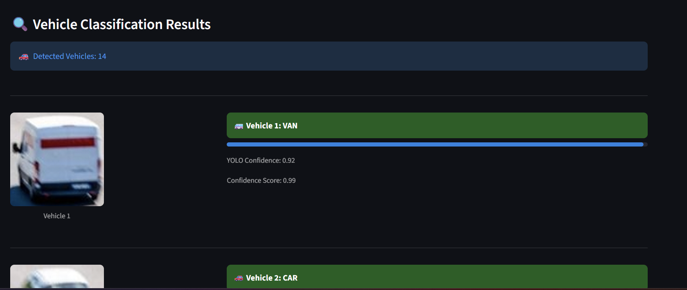

</div>

---

## 📂 Project Structure

```
Vehicle-Detection-and-Classification/
│
├── 📓 notebooks/
│   └── Vehicle_Detection_and_Classification.ipynb   # Full training pipeline
│
├── 🌐 app/
│   └── streamlit_app.py                             # Streamlit web application
│
├── 🤖 models/
│   ├── best_yolo_vehicle.pt                         # Trained YOLOv8 weights
│   └── vehicle_classifier_efficientnet_final.keras   # Trained EfficientNetB0
│
├── 📊 results/
│   └── output_images/                               # Detection & classification outputs
│
├── 🖼️ sample_images/
│   ├── sample1.jpg                                  # Test image 1
│   └── sample2.jpg                                  # Test image 2
│
├── vehicle_dataset.yaml        # YOLO dataset configuration
├── class_indices.json          # Class label mappings
├── requirements.txt            # Python dependencies
├── README.md                   # Project documentation
└── .gitignore                  # Git ignore rules
```

---

## 🔄 Workflow Pipeline

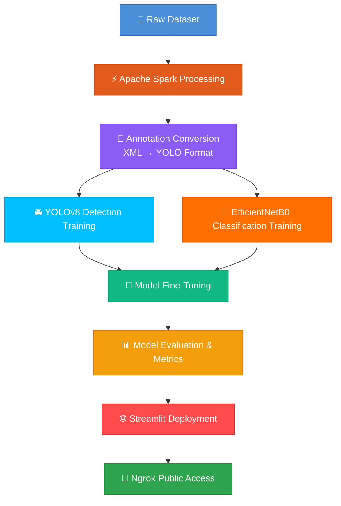

---

## 📊 Dataset Information

This project utilizes two complementary datasets:

<table>
<tr>
<td width="50%">

### 🔍 Vehicle Detection Dataset (VDset)

| Property | Details |
|:---------|:--------|
| Content | Vehicle images with bounding boxes |
| Annotations | Pascal VOC XML → YOLO format |
| Usage | YOLOv8 training & evaluation |

</td>
<td width="50%">

### 🏷️ Vehicle Classification Dataset (VCset)

| Property | Details |
|:---------|:--------|
| Classes | Bus, Car, Motorcycle, Truck, Van |
| Format | Organized by class folders |
| Usage | EfficientNetB0 training & evaluation |

</td>
</tr>
</table>

<div align="center">

> 📥 **Dataset Source:** [Zenodo Vehicle Dataset](https://zenodo.org/records/14792742)

</div>

---

## ⚡ Apache Spark Usage

Apache Spark provides distributed processing capabilities for handling large-scale image datasets efficiently:

- **🔄 Distributed Loading** — Parallel ingestion of large image datasets
- **🔍 Data Validation** — Automated filtering of corrupt or invalid images
- **⚡ Performance** — Significant speedup over sequential processing
- **📈 Scalability** — Seamless handling of growing datasets

---

## 🚀 Quick Start

### Prerequisites

- Python 3.10+
- CUDA-compatible GPU *(recommended for training)*
- Git

### Step 1 — Clone the Repository

```bash
git clone https://github.com/DMInaam/Vehicle-Detection-and-Classification.git
cd Vehicle-Detection-and-Classification
```

### Step 2 — Install Dependencies

```bash
pip install -r requirements.txt
```

### Step 3 — Run the Streamlit App

```bash
streamlit run app/streamlit_app.py
```

### Step 4 *(Optional)* — Public Deployment via Ngrok

```python
from pyngrok import ngrok

# Expose the Streamlit app publicly
public_url = ngrok.connect(8501)
print(f"🔗 Public URL: {public_url}")
```

---

## 🖥️ Technologies Used

<div align="center">

| Category | Technologies |
|:---------|:-------------|
| **Language** |  |
| **Deep Learning** |   |
| **Object Detection** |  |
| **Computer Vision** |  |
| **Big Data** |  |
| **Data Science** |    |
| **Deployment** |   |

</div>

---

## 🎯 Key Features

<div align="center">

| Feature | Description |
|:--------|:------------|
| 🔍 Multi-Vehicle Detection | Simultaneous detection of multiple vehicles in a single frame |
| 🏷️ Multi-Class Classification | Accurate categorization across 5 vehicle types |
| 🔄 Transfer Learning | Pre-trained EfficientNetB0 adapted for vehicle classification |
| 🔧 Fine-Tuning | Layer-wise fine-tuning for domain-specific accuracy gains |
| ⚡ Big Data Processing | Apache Spark for scalable dataset preprocessing |
| ⏱️ Real-Time Predictions | Instant inference through the Streamlit interface |
| 🌐 Interactive Web UI | User-friendly upload, detect, and classify workflow |
| 🔗 Public Deployment | One-click public access via Ngrok tunneling |

</div>

---

## 📊 Final Performance Summary

<div align="center">

<table>
<tr>
<td align="center" width="50%">

### 🚘 Detection — YOLOv8s

| Metric | Score |
|:-------|------:|
| Precision | **95.85%** |
| Recall | **95.63%** |
| mAP@0.5 | **98.94%** |
| mAP@0.5–0.95 | **81.40%** |

</td>
<td align="center" width="50%">

### 🚗 Classification — EfficientNetB0

| Metric | Score |
|:-------|------:|
| Best Val. Accuracy | **94.25%** |
| Final Accuracy | **92.00%** |
| Macro F1-Score | **0.92** |
| Weighted F1-Score | **0.92** |

</td>
</tr>
</table>

</div>

---

## 🔮 Future Work

| Enhancement | Description |
|:------------|:------------|
| 🎥 Real-Time Video Detection | Extend pipeline to process live video streams |
| 🔗 Multi-Object Tracking | Track vehicles across consecutive frames |
| 🔢 Vehicle Counting | Automated traffic counting at intersections |
| 📈 Traffic Analytics Dashboard | Visual analytics for traffic flow and patterns |
| 📱 Edge Deployment | Optimize models for edge devices (Jetson, Coral) |
| ☁️ Cloud Inference | Deploy scalable inference APIs on cloud platforms |

---

## 📌 Applications

<div align="center">

```
┌─────────────────────┐   ┌─────────────────────┐   ┌─────────────────────┐
│  🚦 Intelligent     │   │  🏙️ Smart City      │   │  📹 Vehicle         │
│  Traffic Systems     │   │  Infrastructure     │   │  Surveillance       │
└─────────────────────┘   └─────────────────────┘   └─────────────────────┘

┌─────────────────────┐   ┌─────────────────────┐
│  🅿️ Parking          │   │  📊 Traffic          │
│  Monitoring          │   │  Analysis            │
└─────────────────────┘   └─────────────────────┘
```

</div>

---

## 🏁 Conclusion

This project successfully delivers a **complete, end-to-end vehicle detection and classification system** powered by modern deep learning and big data technologies.

> **YOLOv8** achieves exceptional detection performance with **98.94% mAP@0.5**, while **EfficientNetB0** delivers robust classification at **94.25% validation accuracy** across five vehicle types. Fine-tuning proved critical in maximizing model reliability and generalization.

The integrated pipeline — from Spark-powered data processing through model training to Streamlit deployment — demonstrates how state-of-the-art computer vision can be practically applied to **real-world traffic monitoring and intelligent transportation systems**.

---

## 👨‍💻 Author

<div align="center">

**Mohammed Inaam D**

*Vehicle Detection & Classification System*
*Deep Learning · Computer Vision · Big Data Analytics*

[](https://github.com/DMInaam)

</div>

---

## ⭐ Acknowledgments

- **Dataset:** [Zenodo Vehicle Dataset](https://zenodo.org/records/14792742)
- **YOLOv8:** [Ultralytics](https://docs.ultralytics.com/)
- **EfficientNet:** [TensorFlow Hub](https://www.tensorflow.org/hub)

---

## 📜 License

This project is intended for **educational and research purposes** only.

---

<div align="center">

*If you found this project useful, consider giving it a ⭐ on [GitHub](https://github.com/DMInaam/Vehicle-Detection-and-Classification)!*

</div>
